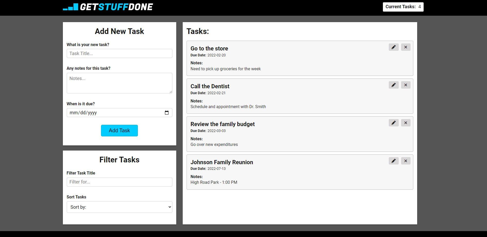

# **GetStuffDone - The Productivity App**

### Built by: [**Grant Greene**](http://www.grantgreene.net)

 

 

## Description:

GetStuffDone is a advanced task tracker that you allows you to track upcoming to-do items and sort them. In addition to basica task tracking functionality, it allows you to edit, delete, sort, and filter tasks. It uses local storage to save/load tasks.

## Technologies Used:

- HTML
- CSS
- Vanilla Javascript
  - ES6 Classes
  - Local Storage

## Features:

- Task counter on top of page to see number of open tasks.
- Filter tasks to find tasks easier.
- Sort tasks both by title and by due date of task.
- Tasks can be edited if error in creation or more information is needed to be added.
- Tasks can be deleted if created in error or if task is completed.
- Notifications when tasks are created, edited, or deleted.
- State of 'Add New Task' pane changes between "edit" mode and "add" mode.

## Working Demo:

[GetStuffDone](http://www.google.com)

** IF USING PRIVATE/INCOGNITO BROWSING, LOCAL STORAGE WILL NOT SAVE TASKS NEXT BROWSER RELOAD **
